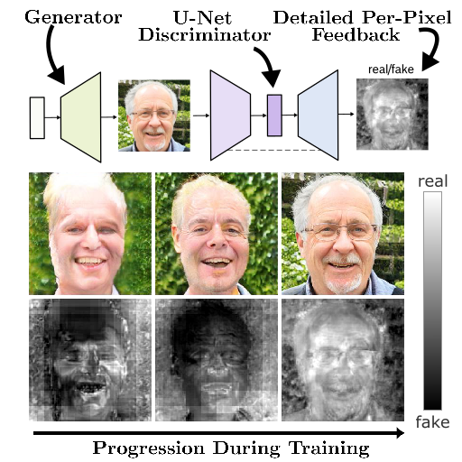

# U-Net GAN PyTorch

PyTorch implementation of the CVPR 2020 paper "A U-Net Based Discriminator for Generative Adversarial Networks". The paper can
be found [here](https://openaccess.thecvf.com/content_CVPR_2020/html/Schonfeld_A_U-Net_Based_Discriminator_for_Generative_Adversarial_Networks_CVPR_2020_paper.html). The code allows the users to
reproduce and extend the results reported in the study.Please cite the
above paper when reporting, reproducing or extending the results.

## Purpose of the project

This software is a research prototype, solely developed for and published as
part of the publication. It will neither be
maintained nor monitored in any way.

## Setup

Create the conda environment "unetgan" from the provided unetgan.yml file. The experiments can be reproduced with the scripts provided in the folder training_scripts (the experiment folder and dataset folder has to be set manually).

|Argument|Explanation|
|---|---|
|--unconditional | Use this if the dataset does not have classes (e.g. CelebA).|
|--unet_mixup | Use CutMix. |
|--slow_mixup | Use warmup for the CutMix-augmentation loss.|
|--slow_mixup_epochs | Number of epochs for the warmup |
|--full_batch_mixup | If True, a coin is tossed at every training step. With a certain probability the whole batch is mixed and the CutMix augmentation loss and consistency_loss is the only loss that is computed for this batch. The probability increases from 0 to 0.5 over the course of the specified warmup epochs. If False, the CutMix augmentation and consistency loss are computed for every batch and added to the default GAN loss. In the case of a warmup, the augmentation loss is multiplied with a factor that increases from 0 to 1 over the course of the specified warmup epochs.|
|--consistency_loss | Compute only the CutMix consistency loss, but not the CutMix augmentation loss  (Can increase stability but might perform worse). |
|--consistency_loss_and_augmentation | Compute both CutMix augmentation and consistency loss.|

## Details

This implementation of U-Net GAN is based on the PyTorch code for BigGAN (https://github.com/ajbrock/BigGAN-PyTorch). The main differences are that (1) we use our own data-loader which does not require HDF5 pre-processing, (2) applied changes in the generator and discriminator class in BigGAN.py, and (3) modified train.py and train_fns.py.

## License

U-Net GAN PyTorch is open-sourced under the AGPL-3.0 license. See the
[LICENSE](LICENSE) file for details.

For a list of other open source components included in PROJECT-NAME, see the
file [3rd-party-licenses.txt](3rd-party-licenses.txt).
